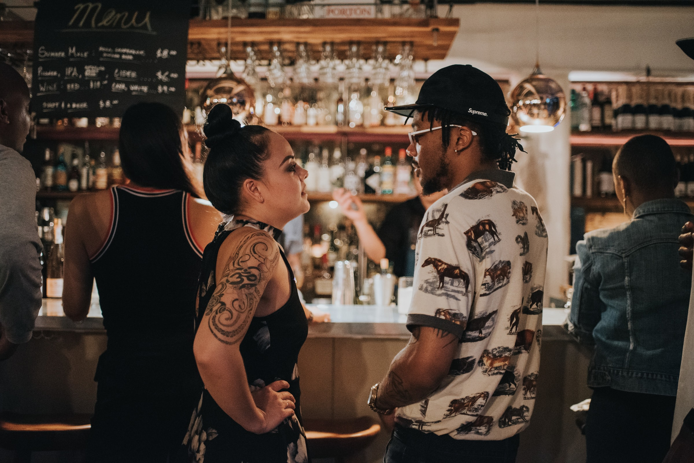

<h1 align='center'> 

**<h1 align = 'center'>Safer Spaces**

_<h2 align ='center'>A community based way to vet the venues you and your friends frequent_

_<h3 align ='center'>README.md created using [MakeMeTakeMeReadMe](https://github.com/tmemmerson/MakeMeTakeMeReadMe.Solution)_

<h3 align ='center'>•<a href='#requirements'> Requirements</a> •<a href='#setup'> Setup</a> •<a href='#technologies-used'> Technologies</a> •<a href='#❤️contributors'> Contributors</a> •<a href='#known-bugs'> Bugs</a> •<a href='#cloning'> Cloning</a> •<a href='#app-settings'> AppSettings</a> •<a href='#database-with-migrations'> Database</a></h3>

<h3 align='center'>About this project:</h3>

# **REQUIREMENTS**

_[Visual Studio Code](https://code.visualstudio.com/)_

_[MySql Workbench](https://www.mysql.com/products/workbench/)_

_[.Net Core v2.2](https://dotnet.microsoft.com/download/dotnet-core/2.2)_

# **SETUP**

## **CLONING**

- Copy the repo link as shown in the image below

- Paste the link in the field provided by VsCode as thown in the image below

- You will be prompted to open the directory once you have cloned it. Select 'open'

 

# **APP SETTINGS**

**You need to update your username and password in the appsettings.json file.**

_By default these are set to user:root and an empty password. If you are unsure, refer to the settings for your MySqlWorkbench._

 

# **OBTAINING AN API KEY**

In order to use this project, you will need to obtain an API key from the Google Places public API. You can find instructions for this process here: [Google Places API](https://developers.google.com/places/web-service/get-api-key). Once you obtain the key, you will create a file in the `Models` directory of `SaferSpacesApi`.

# **DATABASE WITH MIGRATIONS**

with the root project folder open in your code editor, execute the following in your terminal:

`cd ProjectName`

`dotnet restore`

`dotnet build`

`dotnet ef database update`

`dotnet watch run`

 

# **TECHNOLOGIES USED**

_[C#](https://docs.microsoft.com/en-us/dotnet/csharp/)_

_[CSS](https://en.wikipedia.org/wiki/Cascading_Style_Sheets)_

_[Bootstrap](https://getbootstrap.com/)_

_[Bootswatch](https://bootswatch.com/)_

_[Asp.Net MVC](https://dotnet.microsoft.com/apps/aspnet/mvc)_

_[HTML](https://developer.mozilla.org/en-US/docs/Web/HTML)_

_[Visual Studio Code](https://code.visualstudio.com/)_

_[MySql Workbench](https://www.mysql.com/products/workbench/)_

 

# **MVP Goals**

| Goal                                                                                                        | Completed(Y/N?) | Notes                                                                                                                                 |
| ----------------------------------------------------------------------------------------------------------- | --------------- | ------------------------------------------------------------------------------------------------------------------------------------- |
| About section on Home Index View with details about project                                                 | Y               | Add About section                                                                                                                     |
| Create database, seed data with clubs, bars, et.                                                            | Y               | Removed once Google Places Api was implemented                                                                                        |
| Create a class for Place, Event and Testimonials                                                            | Y               | n/a                                                                                                                                   |
| Search by common elements such as venue or address to bring up list view of nearby nightlife                | Y               | n/a                                                                                                                                   |
| Click on a locationto view its details (name, place type, address, description, % of testimonials)          | Partial         | Place details show, link to add testimonials and events show, but unable to add testimonials and events at this time so cannot view % |
| User can log in or register and log off                                                                     | Y               | n/a                                                                                                                                   |
| Use authorization to redirect to login page if user tries to post a testimonial / event while not logged in | Not yet         | Need to add authorization to routes                                                                                                   |
| Add a testimonial or event to a place                                                                       | Not yet         | Able to view form, unable to post at this time                                                                                        |

# **Specifications Stretch Goals**

| Goal                                                    | Completed(Y/N?) |
| ------------------------------------------------------- | --------------- |
| Refuge Restroom API                                     | Not yet         |
| More safety details                                     | Not yet         |
| Email verification (OAuth) and notifications            | Not yet         |
| Ability to follow businesses                            | Not yet         |
| Add pagination Api and Frontend/Infinite Scroll         | Not yet         |
| Add message if user tries to register a registered user | Not yet         |

# **KNOWN BUGS**

_**AddTestimonials and AddEvents forms currently do not post to API as of:** 8/27/2020_

 

# **❤️Contributors**

| [ <b>Brittany Lindgren</b>](https://www.linkedin.com/in/brittanylindgren/) 

| [ <b>Erich Richter</b>](https://www.linkedin.com/in/erichjrichter/) 

| [ <b>Jason Khan</b>](https://www.linkedin.com/in/jasonkhan99/) 

| [ <b>Mariel Hamson</b>](https://www.linkedin.com/in/marielhamson/) 

 

safety community bars restaurants

 

![alt text][logo]

[logo]: https://img.shields.io/bower/l/bootstrap 'MIT License'
